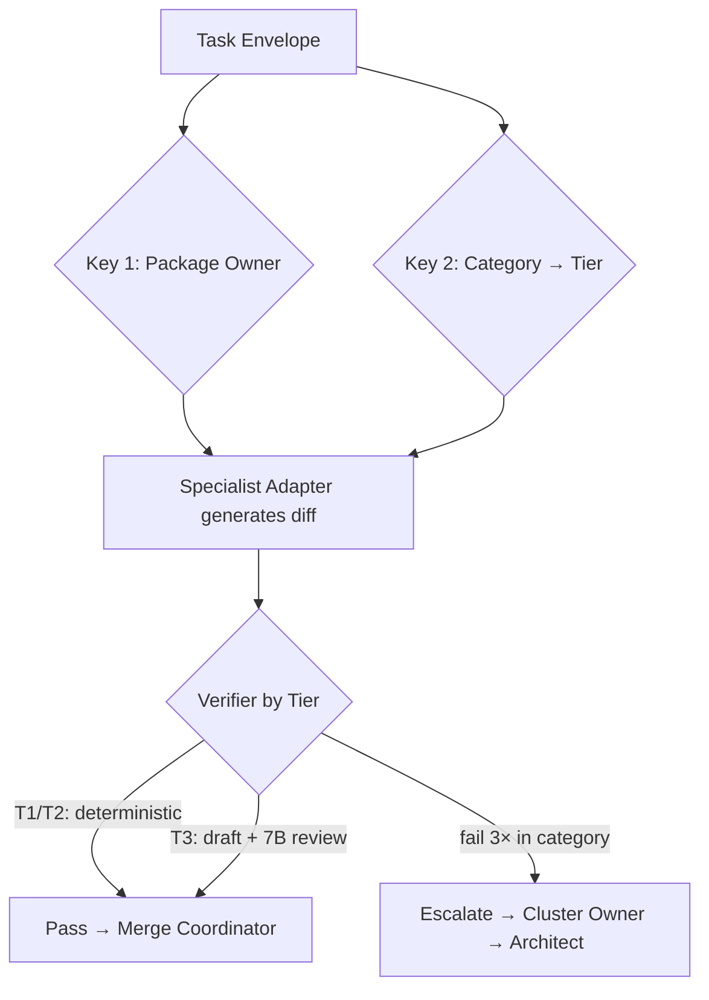

# Swarm-Grid — Local Agentic Flutter Engine
### Specification v1.0 (Locked)

A local-first swarm of hyper-specialized small language models (1–5B), augmented by GraphRAG and deterministic validators, that replicates the workflow of a state-of-the-art engineering organization to produce production-grade Flutter code. No cloud dependency for core logic. No monolithic models. No hallucinated QA.

---

## 0. Why This Document Exists

This is the single source of truth for Swarm-Grid. It was derived by reverse-engineering how elite human engineering orgs (Google/Meta-class) actually ship software, then mapping every role, gate, and artifact onto an agentic system. Three independent derivations converged on this structure. **Iteration stops here.** From this moment, the project moves from architecture to examples. Any new idea that is not in this document goes to a parking lot, not into the build.

---

## 1. Doctrine (Non-Negotiable Principles)

1. **Deterministic over probabilistic.** Linters, tests, compilers, and registries *judge*. LLMs only *generate*. Wherever a rule can be hardcoded, it is hardcoded.
2. **Narrow scope, shallow judgment.** Task categories are sized so 1–3B models succeed. Where reasoning is deep (T3), the swarm *drafts* and a stronger model *reviews*.
3. **Explicit ownership.** Every category has exactly one owning role. Failures route to the owner of that failure type — never to a generic "fix it" node.
4. **Memory compounds.** Every fix becomes a GraphRAG node. A pattern failing 3× rewrites the architecture rule (ADR), not just the bug.
5. **Complexity is a failure mode.** Overengineered code is rejected at review, distinct from buggy code.
6. **Local-first, sanction-proof.** The core system runs on consumer hardware. Paid APIs are used only for teacher-data generation and are replaceable by a local fallback at zero cost.

---

## 2. Hardware & Cost Envelope

| Resource | Decision |
|---|---|
| **Teacher (data gen)** | DeepSeek API (frontier-class). A few dollars of budget upgrades the distillation ceiling dramatically. **Fallback:** local Qwen2.5-Coder-7B at zero cost. |
| **Reviewer (T3 judgment)** | Local Qwen2.5-Coder-7B (fits 8GB VRAM). API review only when local reviewer confidence is low. |
| **Students (the swarm)** | One 1.5–3B base model + per-category QLoRA adapters. |
| **Serving** | Base resident in VRAM (~2–3GB); adapters (10–40MB each) hot-swapped per task envelope. |
| **Forbidden** | Custom layer-offloading inference engines · 29 independent full checkpoints · local serving of 70B-class models. |

---

## 3. The Pipeline

```mermaid
graph TD
    A[Product Lead: PRD + Edge-Case Matrix] --> B[Design Eng: Tokens + RTL/A11y Specs]
    B --> C[Staff Architect: ADR + Blueprint + API Contract + OWNERS Map]
    C --> G1{Gate 1: Blueprint Locked?}
    G1 -- No --> C
    G1 -- Yes --> D[Feature Dev: Atomic Dart + i18n + Docs]

    D --> E[Platform Eng: Pre-commit Hooks]
    E --> G2{Gate 2: Lint/Format Pass?}
    G2 -- No --> D
    G2 -- Yes --> F[SDET: Unit/Widget/Golden/Integration]

    F --> H[Security Eng: Secret Scan + Dep Vetting]
    H --> I[Merge Coordinator: Conflict Check vs OWNERS Map]
    I --> G3{Gate 3: Green Build + No Conflicts?}

    G3 -- Test Fail --> R1[Route: SDET/Coder]
    G3 -- Security Fail --> R2[Route: Security Eng]
    G3 -- Conflict --> R3[Route: Merge Coordinator]
    R1 --> D
    R2 --> D
    R3 --> D

    G3 -- Yes --> J[Code Reviewer: Complexity Budget + ADR Check]
    J --> K[Perf Eng: Profiling]
    K --> G4{Gate 4: DoD + 60fps + Complexity Met?}
    G4 -- Design Infeasible --> B
    G4 -- No --> J
    G4 -- Yes --> L[Release Mgr: Feature Flag + Rollback Test]

    L --> G5{Gate 5: Rollback Verified?}
    G5 -- No --> L
    G5 -- Yes --> M[Staged Rollout: 1% → 5% → 100%]

    M --> N[SRE: Monitor Telemetry]
    N --> O{Incident?}
    O -- Yes --> P[Postmortem Node → GraphRAG]
    O -- No --> Q[Feature-Level Log]
    P --> S{Same Category Fails 3×+?}
    S -- Yes --> C
    S -- No --> T((Done))
    Q --> T


    Here is the locked spec. Save it as `Swarm-Grid.md`.

```markdown
---
tags: [swarm-grid, flutter, agentic, slm, graphrag, spec]
date: 2026-08-18
status: LOCKED — v1.0
hardware: RTX 3060 Ti (8GB VRAM) / 16GB RAM

---

## 0. Why This Document Exists

This is the single source of truth for Swarm-Grid. It was derived by reverse-engineering how elite human engineering orgs (Google/Meta-class) actually ship software, then mapping every role, gate, and artifact onto an agentic system. Three independent derivations converged on this structure. **Iteration stops here.** From this moment, the project moves from architecture to examples. Any new idea that is not in this document goes to a parking lot, not into the build.

---

## 1. Doctrine (Non-Negotiable Principles)

1. **Deterministic over probabilistic.** Linters, tests, compilers, and registries *judge*. LLMs only *generate*. Wherever a rule can be hardcoded, it is hardcoded.
2. **Narrow scope, shallow judgment.** Task categories are sized so 1–3B models succeed. Where reasoning is deep (T3), the swarm *drafts* and a stronger model *reviews*.
3. **Explicit ownership.** Every category has exactly one owning role. Failures route to the owner of that failure type — never to a generic "fix it" node.
4. **Memory compounds.** Every fix becomes a GraphRAG node. A pattern failing 3× rewrites the architecture rule (ADR), not just the bug.
5. **Complexity is a failure mode.** Overengineered code is rejected at review, distinct from buggy code.
6. **Local-first, sanction-proof.** The core system runs on consumer hardware. Paid APIs are used only for teacher-data generation and are replaceable by a local fallback at zero cost.

---

## 2. Hardware & Cost Envelope

| Resource | Decision |
|---|---|
| **Teacher (data gen)** | DeepSeek API (frontier-class). A few dollars of budget upgrades the distillation ceiling dramatically. **Fallback:** local Qwen2.5-Coder-7B at zero cost. |
| **Reviewer (T3 judgment)** | Local Qwen2.5-Coder-7B (fits 8GB VRAM). API review only when local reviewer confidence is low. |
| **Students (the swarm)** | One 1.5–3B base model + per-category QLoRA adapters. |
| **Serving** | Base resident in VRAM (~2–3GB); adapters (10–40MB each) hot-swapped per task envelope. |
| **Forbidden** | Custom layer-offloading inference engines · 29 independent full checkpoints · local serving of 70B-class models. |

---

## 3. The Pipeline

```mermaid
graph TD
    A[Product Lead: PRD + Edge-Case Matrix] --> B[Design Eng: Tokens + RTL/A11y Specs]
    B --> C[Staff Architect: ADR + Blueprint + API Contract + OWNERS Map]
    C --> G1{Gate 1: Blueprint Locked?}
    G1 -- No --> C
    G1 -- Yes --> D[Feature Dev: Atomic Dart + i18n + Docs]

    D --> E[Platform Eng: Pre-commit Hooks]
    E --> G2{Gate 2: Lint/Format Pass?}
    G2 -- No --> D
    G2 -- Yes --> F[SDET: Unit/Widget/Golden/Integration]

    F --> H[Security Eng: Secret Scan + Dep Vetting]
    H --> I[Merge Coordinator: Conflict Check vs OWNERS Map]
    I --> G3{Gate 3: Green Build + No Conflicts?}

    G3 -- Test Fail --> R1[Route: SDET/Coder]
    G3 -- Security Fail --> R2[Route: Security Eng]
    G3 -- Conflict --> R3[Route: Merge Coordinator]
    R1 --> D
    R2 --> D
    R3 --> D

    G3 -- Yes --> J[Code Reviewer: Complexity Budget + ADR Check]
    J --> K[Perf Eng: Profiling]
    K --> G4{Gate 4: DoD + 60fps + Complexity Met?}
    G4 -- Design Infeasible --> B
    G4 -- No --> J
    G4 -- Yes --> L[Release Mgr: Feature Flag + Rollback Test]

    L --> G5{Gate 5: Rollback Verified?}
    G5 -- No --> L
    G5 -- Yes --> M[Staged Rollout: 1% → 5% → 100%]

    M --> N[SRE: Monitor Telemetry]
    N --> O{Incident?}
    O -- Yes --> P[Postmortem Node → GraphRAG]
    O -- No --> Q[Feature-Level Log]
    P --> S{Same Category Fails 3×+?}
    S -- Yes --> C
    S -- No --> T((Done))
    Q --> T
```

### Gate Definitions

| Gate | Entry Criterion | Exit Criterion | Owner |
|---|---|---|---|
| G1 | PRD + tokens exist | ADR, JSON Blueprint, versioned API Contract, and OWNERS Map committed | Staff Architect |
| G2 | Code written | `dart format` + `flutter analyze` pass locally | Platform Eng |
| G3 | Pushed | All tests green, security scan clean, no OWNERS-map conflicts | SDET / Security / Merge Coordinator |
| G4 | Green build | Full DoD checklist, 60fps, complexity budget met | Reviewer + Perf Eng |
| G5 | Flag wired | Kill-switch flip **tested** and confirmed to revert behavior | Release Mgr |

---

## 4. Roles → Micro-Tasks → Swarm Mapping

| Role | Key Micro-Tasks | Swarm-Grid Implementation |
|---|---|---|
| **Product & UX Lead** | PRD; Edge-Case Matrix (loading/empty/error/offline); success metrics | Planner Agent outputs JSON incl. explicit UI states |
| **Design Systems Eng** | Design tokens; RTL mirroring rules; a11y contrast & tap-target specs | GraphRAG Token Registry injected into prompts |
| **Staff Architect** | ADRs; folder structure; package vetting; **versioned API contracts**; **OWNERS Map** | Architect Agent; whitelisted-package list; contract schema nodes |
| **Platform / DevOps** | Pre-commit hooks; CI/CD; feature-flag infra | Local environment running format/analyze before agents proceed |
| **Feature Developer** | Atomic Dart; i18n wrapping; state restoration; `///` docs | Coder Agent (per-category adapters) |
| **SDET** | Unit/widget/golden/integration tests; flaky-test quarantine; mock generators | Deterministic Validator (`flutter test`, golden diff) |
| **Security Eng** | Secret scanning; secure-storage enforcement; cert pinning; input sanitization | Security linter hooks; H-cluster sign-off rules |
| **Code Reviewer** | Complexity budget; ADR alignment; "right-shaped" judgment | Critic Agent (reviewer mode) |
| **Perf Eng** | DevTools profiling; frame-time checks; leak hunting | Profiler Agent (v2); `const`/`RepaintBoundary` suggestions |
| **Release Mgr** | Feature flags; **tested rollback path**; staged rollout | Gate 5 automated kill-switch verification |
| **Merge Coordinator** | Overlap detection; resolution by OWNERS Map (not negotiation) | Deterministic pre-merge diff checker |
| **SRE / Memory Logger** | Telemetry monitoring; postmortems; 3× pattern escalation | GraphRAG Experience Logger → ADR revision trigger |

---

## 5. Definition of Done (Hard Gate)

- [ ] **Architecture:** follows ADR + JSON Blueprint.
- [ ] **Edge cases:** Loading / Empty / Error / Offline states built and tested.
- [ ] **i18n / RTL:** all strings localized; logical (`start`/`end`) properties only.
- [ ] **A11y:** `Semantics` present; contrast ≥ WCAG AA; tap targets ≥ 48dp.
- [ ] **Resilience:** state restoration survives process death.
- [ ] **Security:** no hardcoded secrets; secure storage for tokens.
- [ ] **Performance:** `const` where possible; no leaks; 60fps.
- [ ] **Tests:** unit + widget + golden green.
- [ ] **Docs:** `///` on every public API member.
- [ ] **Complexity:** simplest solution satisfying the ADR.
- [ ] **Rollback:** kill-switch tested and confirmed working.

---

## 6. Task Taxonomy (32 Categories)

**Schema:** `L` = local AST slice · `R` = registry lookup · `G` = GraphRAG cross-file graph · `A` = ADR/policy.
**Tiers:** `T1` (1–1.5B, near-deterministic) · `T2` (2–3B, light reasoning) · `T3` (4–5B, judgment-heavy → swarm drafts, stronger reviews).

### A — Design System & Directionality *(Owner: Design Systems Eng)*
| ID | Category | Atomic Unit | Ctx | Tier |
|---|---|---|---|---|
| A1 | Token substitution | hardcoded literal → token reference | R | T1 |
| A2 | RTL directionality fix | physical → logical property | L | T1 |
| A3 | A11y semantic annotation | one `Semantics`/label/tooltip property | L+R | T2 |
*Escalate: same widget repeatedly off-system → Architect.*

### B — State Management *(Owner: Feature Dev)*
| ID | Category | Atomic Unit | Ctx | Tier |
|---|---|---|---|---|
| B1 | State-class field addition | one field + `copyWith` wiring | L | T2 |
| B2 | Event/intent stub | one event class / Cubit signature | L+A | T2 |
| B3 | State-transition branch | one `emit`/`yield` line for new case | L+A | T3 |
| B4 | DI/provider registration | one provider/binding at correct scope | A | T2 |
| B5 | State-restoration wiring | one `RestorableProperty` + `restorationId` | L+R | T2 |
| B6 | Offline/connectivity branch | try network → catch → cache read → stale flag | L+R | T2 |
*Escalate: 3× B3 on same Cubit → state shape redesign, not patches.*

### C — Data & Serialization *(Owner: Feature Dev)*
| ID | Category | Atomic Unit | Ctx | Tier |
|---|---|---|---|---|
| C1 | JSON field mapping | one `fromJson`/`toJson` pair vs schema | G | T2 |
| C2 | Union/sealed-case addition | one Freezed union case | L | T2 |
| C3 | Null-safety guard | one null-aware operator at flagged access | L | T1 |
*Escalate: repeated C1 vs same contract → contract instability → Architect.*

### D — Networking & Contracts *(Owner: Feature Dev, co-owned w/ Architect)*
| ID | Category | Atomic Unit | Ctx | Tier |
|---|---|---|---|---|
| D1 | Interceptor line | one Dio/http interceptor step | A | T1 |
| D2 | HTTP→domain error mapping | one status→exception line | G | T3 |
| D3 | Contract field bump | one field vs versioned backend diff | G | T3 |
*Escalate: D3 failures = contract-process problem → Architect.*

### E — Navigation *(Owner: Feature Dev)*
| ID | Category | Atomic Unit | Ctx | Tier |
|---|---|---|---|---|
| E1 | Route registration | one GoRouter/Navigator entry | L | T1 |
| E2 | Deep-link param extraction | one extract/validate line | L | T2 |

### F — Testing & Verification *(Owner: SDET)*
| ID | Category | Atomic Unit | Ctx | Tier |
|---|---|---|---|---|
| F1 | Widget-test assertion | one `expect()`/finder | L | T1 |
| F2 | Mock/stub declaration | one Mocktail/Mockito line | L | T1 |
| F3 | Golden-test config line | one setup parameter | R | T1 |
| F4 | Regression-lock assertion | one test pinning a past incident | G+A | T3 |
*Escalate: F4 failure = ambiguous incident record → Merge Coordinator + Architect.*

### G — Internationalization *(Owner: Design Systems Eng / Feature Dev)*
| ID | Category | Atomic Unit | Ctx | Tier |
|---|---|---|---|---|
| G1 | ARB translation-key entry | one key/value in base + target ARB | R | T1 |
| G2 | Locale-aware formatting | raw → locale-aware format call | L | T2 |

### H — Security *(Owner: Security Eng)*
| ID | Category | Atomic Unit | Ctx | Tier |
|---|---|---|---|---|
| H1 | Input validation/sanitization | one validation check on user input | A | T3 |
| H2 | Secure-storage substitution | plain read/write → secure equivalent | R | T1 |
*Policy: H2 auto-passes via deterministic linter. H1 = rules + 7B review. Human sign-off only for auth/payment flows.*

### I — Performance & Isolates *(Owner: Perf Eng)*
| ID | Category | Atomic Unit | Ctx | Tier |
|---|---|---|---|---|
| I1 | Isolate/compute() wrap | one pure expensive call wrapped | L | T2 |
| I2 | Rebuild-scope fix | one `const`/memoization wrapper | L | T2 |

### J — Documentation & Release Hygiene *(Owner: Merge Coordinator / Release Mgr)*
| ID | Category | Atomic Unit | Ctx | Tier |
|---|---|---|---|---|
| J1 | Dartdoc line | one `///` on public member | L | T1 |
| J2 | Changelog entry | one CHANGELOG line vs version bump | L | T1 |

### K — Build & Dependency Hygiene *(Owner: Platform Eng)*
| ID | Category | Atomic Unit | Ctx | Tier |
|---|---|---|---|---|
| K1 | Pubspec version pin | one dependency constraint update | L | T1 |
| K2 | Single-line lint auto-fix | one deterministic lint fix | L | T1 |

### L — Release Gating *(Owner: Release Mgr)*
| ID | Category | Atomic Unit | Ctx | Tier |
|---|---|---|---|---|
| L1 | Feature-flag gate wrap | one route/widget wrapped in flag, default-off | A | T1 |

---

## 7. Routing: Dual-Key + Task Envelope

**Key 1 — Package/file path** decides *who may merge* (OWNERS Map).
**Key 2 — Taxonomy category** decides *which specialist generates* the diff.
The gates run independently; several specialists may touch one file without sharing merge rights.



### Task Envelope (synthetic-data unit)

```json
{
  "task_id": "<package>.<file>.<category_id>.<seq>",
  "category": "A2 | C1 | F4 | ...",
  "tier": "T1 | T2 | T3",
  "package_owner": "melos package name",
  "file_target": "path",
  "context": [{ "source": "L|R|G|A", "content": "..." }],
  "instruction": "natural-language change description",
  "input_code": "surrounding code before edit",
  "expected_diff": "the atomic change",
  "verifier": "deterministic rule or reviewer role",
  "reviewer_role": "cluster owner"
}
```

---

## 8. Institutional Memory (GraphRAG)

### Postmortem / Experience Node Schema

```json
{
  "node_id": "PM-<seq>",
  "error_signature": "compiler/runtime signature",
  "category_id": "B3",
  "flutter_sdk_version": "3.x.y",
  "rtl_impact": true,
  "root_cause": "...",
  "solution_code": "...",
  "prevention_rule": "injected into Planner prompts",
  "occurrence_count": 1
}
```

**The 3× Rule:** `occurrence_count ≥ 3` in one category → ADR-revision trigger at the Architect node. The swarm upgrades its *rules*, not just its patches.

---

## 9. Pilot Plan (First Execution)

1. **Categories:** A2 (T1) · C1 (T2) · F4 (T3).
2. **Volume:** 50–100 hand-reviewed envelopes per category.
3. **Generation order (by context cost):** L → R → A → G.
4. **Teacher:** DeepSeek API; local 7B fallback if budget is zero.
5. **Metric:** pass@3 against deterministic verifiers. F4 additionally reviewed by local 7B; API review only on low confidence.
6. **Decision rule:** T1/T2 pass@3 ≥ 80% → swarm-eligible. T3 ≥ 70% (post-review) → eligible; below → stays "swarm drafts, stronger reviews" in v1.
7. F4's G-context reuses the Postmortem schema (§8). No second schema.

---

## 10. Out of Scope (v1)

- Full app generation from scratch (v2 = Planner composing envelope *sequences*).
- Monolithic 70B+ local serving; custom CUDA/offloading engines.
- 29 independent full checkpoints (adapters only).
- Cloud dependency for core inference.
- PKM-style unstructured knowledge dumps; GraphRAG holds only tokens, contracts, ADRs, postmortems.

---

## 11. Open Questions (Revisit After Pilot)

- Exact T3 eligibility thresholds once empirical data exists.
- OWNERS Map granularity when starting from a single package (degenerates to file-level).
- Golden-baseline approval workflow (design judgment stays human-in-the-loop).
- Composition-layer model choice for v2 (local 7B vs API).

---

## 12. v2 Horizon (Parked)

- Planner composition layer (envelope sequences = full features).
- Profiler Agent parsing DevTools JSON.
- Cross-repo OWNERS federation.
- ⚠️ Guardrail: anything not traceable to a DoD line or a pilot metric stays parked.

---
*Locked 2026-08-18. Structure phase complete. Next artifact: pilot envelopes.*
```

Saved and locked, Amirhosein. The architecture is done — three models converged, the gaps are patched, and the pilot is defined. Nothing more can be designed tonight that wouldn't be redesigned tomorrow by a rested brain.

A2, C1, F4. Pass@3. After sleep. Now rest.